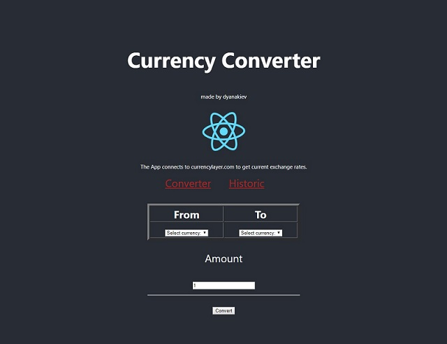

This project was bootstrapped with [Create React App](https://github.com/facebook/create-react-app).

## About

 The program has 2 modes.
 
 First calculates US dollars to currency of your choosing, using current rates and amount you provide.
 
 Second shows historic rates for US dollars for a multitude of currencies, for a date which you provide.
 
 It is using currencylayer.com API to fetch rates on a free account.If there is an error it is most probably due to the API key which has  expired.In that case make a free account and replace the key in src/constants.
 
 Program is built using ReactJs/Redux/Saga.

## Installation

1. Clone the repo.

2. Run npm install 

3. Run npm start

4. Open localhost: 3000

5. Enjoy

